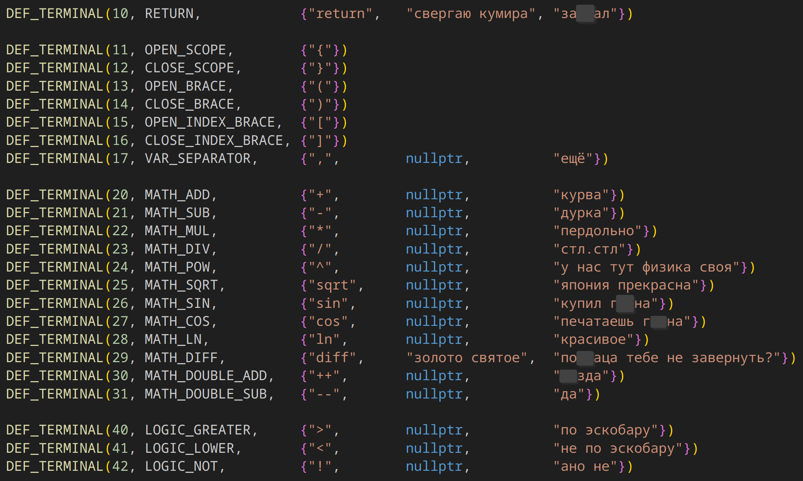
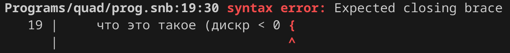
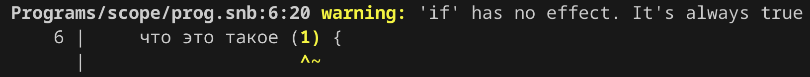
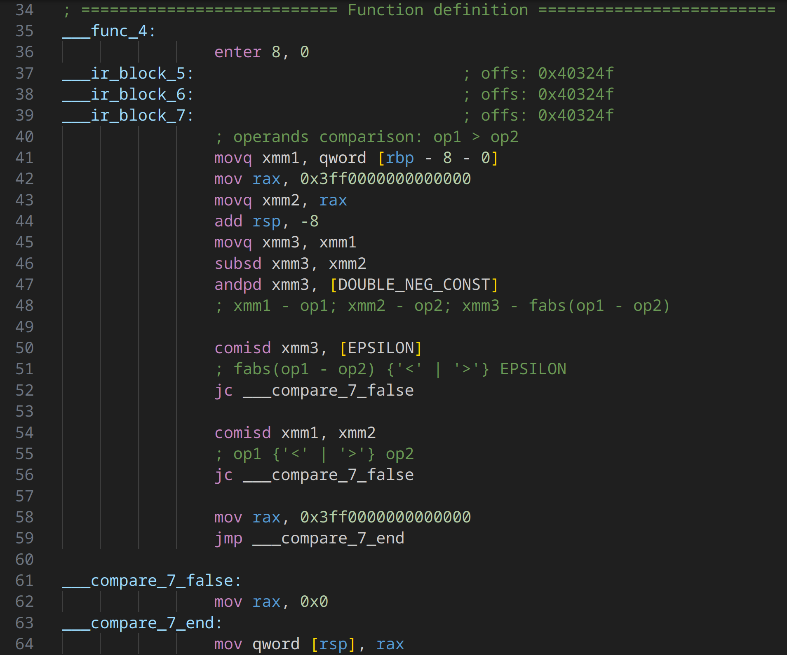
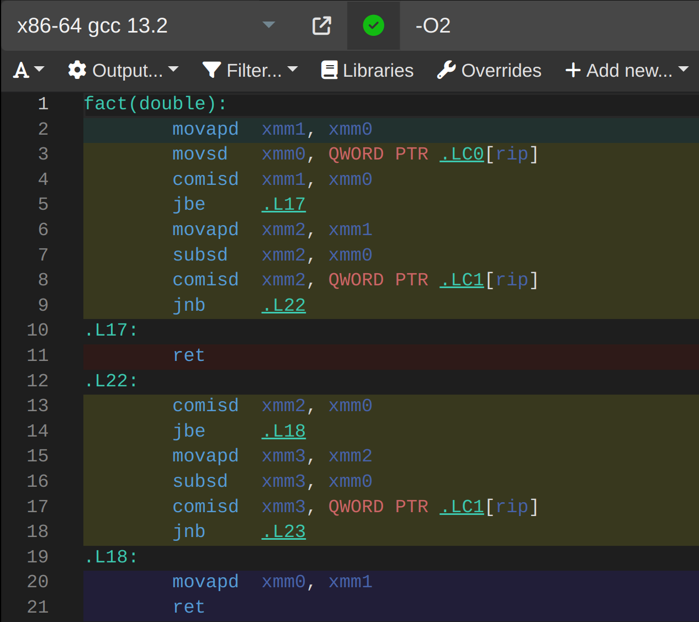
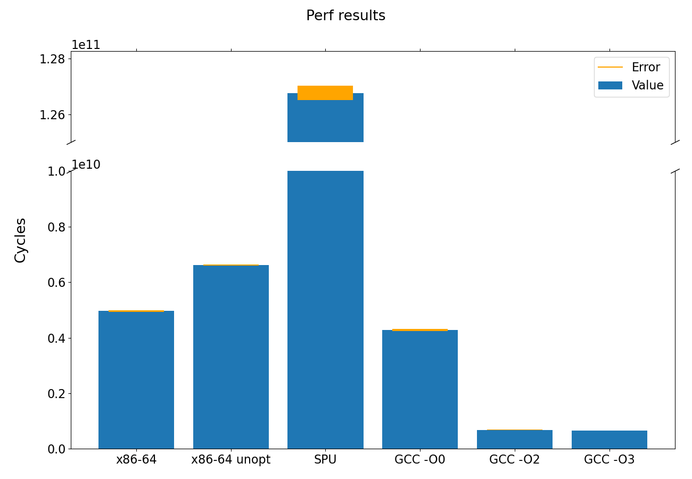
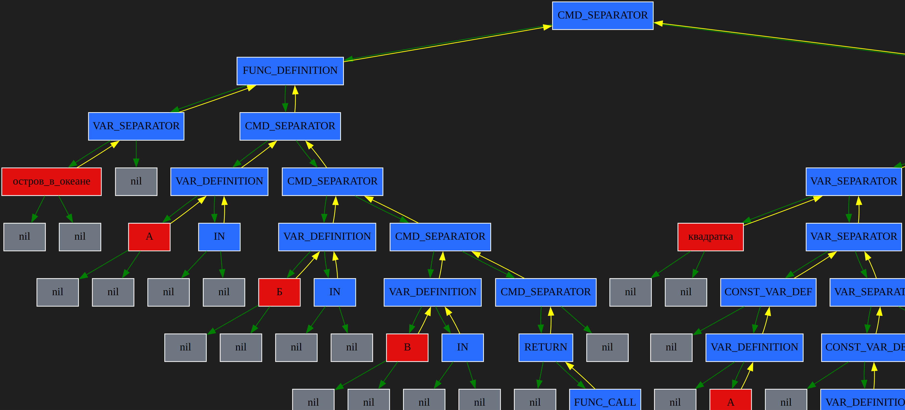

# Компилятор

Компиляция программ на своём эзотерическом языке для [собственного `SPU`](https://github.com/ralex2304/Processor) и `x86-64`.

[comment]: <> (Autogenerated contents section beginning)

## Содержание

1. [Процесс компиляции](#процесс-компиляции)
    1. [Frontend](#frontend)
        1. [Лексер](#лексер)
        2. [Парсер](#парсер)
        3. [Стандарт AST](#стандарт-ast)
        4. [Обработка синтаксических ошибок](#обработка-синтаксических-ошибок)
    2. [Middleend](#middleend)
        1. [Возможности](#возможности)
        2. [Реализация оптимизаций](#реализация-оптимизаций)
        3. [Предупреждения](#предупреждения)
    3. [Backend](#backend)
        1. [Стандарт IR](#стандарт-ir)
    4. [IR Backend](#ir-backend)
2. [Возможности и особенности языка](#возможности-и-особенности-языка)
    1. [Синтаксические конструкции](#синтаксические-конструкции)
3. [Примеры программ](#примеры-программ)
    1. [Рекурсивный расчёт факториала](#рекурсивный-расчёт-факториала)
    2. [Демонстрация работы областей видимости переменных](#демонстрация-работы-областей-видимости-переменных)
4. [Сравнение производительности скомпилированных программ](#сравнение-производительности-скомпилированных-программ)
    1. [Программа на моём языке](#программа-на-моём-языке)
    2. [Программа на `C++`](#программа-на-c)
    3. [Сравнение сгенерированного ассемблерного кода](#сравнение-сгенерированного-ассемблерного-кода)
    4. [Измерение производительности](#измерение-производительности)
        1. [Результаты](#результаты)
5. [Заметки о разработке](#заметки-о-разработке)
    1. [Развитие проекта](#развитие-проекта)
    2. [Отладка](#отладка)
        1. [Логи](#логи)
        2. [Графические дампы](#графические-дампы)
6. [Зависимости](#зависимости)
    1. [Зависимости сборки](#зависимости-сборки)
        1. [Библиотеки](#библиотеки)
            1. [Установка](#установка)
    2. [Зависимости компиляции](#зависимости-компиляции)
7. [Использование](#использование)
    1. [Сборка](#сборка)
        1. [Release версия](#release-версия)
        2. [Debug версия](#debug-версия)
    2. [Компиляция программы](#компиляция-программы)
        1. [Опции компиляции](#опции-компиляции)
8. [Источники и инструменты](#источники-и-инструменты)
9. [Благодарности](#благодарности)

[comment]: <> (Autogenerated contents section ending)

## Процесс компиляции


- [Frontend](#frontend) - лексический разбор текста программы и создание абстрактного синтаксического дерева (AST);
- [Middleend](#middleend) - оптимизации и преобразования AST:
    - свёртка констант;
    - удаление мёртвого кода;
    - дифференцирование математических выражений;
- [Backend](#backend) - генерация линейного архитектурно-независимого промежуточного представления (IR);
- [IR Backend](#ir-backend) - обработка IR:
    - оптимизации:
        - удаление избыточных парных перемещений данных;
        - свёртка операций со стеком;
    - создание бинарного исполняемого файла программы, генерация ассемблерного листинга.

> [!NOTE]
> Компилятор состоит из 4 отдельных программ, описание которых находится ниже. Их названия обусловлены [историей развития проекта](#развитие-проекта). Традиционно структура компилятора несколько другая. Например, в LLVM синтаксическое дерево не выходит за пределы frontend, а части компилятора обмениваются IR. В данном проекте основной структурой является AST, поэтому IR появляется лишь на backend.

### Frontend

#### Лексер

Сначала текст программы разбирается на лексемы. Такой подход позволил облегчить дальнейшую обработку конструкций языка, ввести синонимичные ключевые слова, а также игнорировать комментарии.



> [!NOTE]
> [Полный список ключевых слов](frontend/src/terminals.h). **Осторожно, встречается ненормативная лексика.**

#### Парсер

Массив лексем преобразуется в абстрактное синтаксическое дерево (AST) при помощи алгоритма рекурсивного спуска. Так как реализация алгоритма тяжело читаема после написания, для верификации и дальнейшей поддержки был создан файл с формальным описанием синтаксических конструкций и приоритета операций языка.

Условные обозначения:
- `<expr name> := <expr>` - определение нового типа выражения
- `'<keyword>'` - ключевое слово
- `{<expr>}` - скобки для обозначения приоритета
- `!<expr>` - выражение не должно встретиться
- `<expr>?` - необязательное выражение
- `<expr>*` - выражение может не встретиться или встретиться несколько раз
- `<expr1> | <expr2>` - выражение 1 или выражение 2

```
// 'CH_' - means that function exits without error (gives choice)

Main := {'CMD_SEPARATOR'? {CH_DefFunc | CH_DefVar} 'CMD_SEPARATOR'?}* 'TERMINATOR'

CH_DefFunc := VarName {'VAR' | 'CONST'} 'OPEN_BRACE' FuncArgsDef 'CLOSE_BRACE' 'CMD_SEPARATOR'? CH_Commands

CH_DefVar := VarName {'OPEN_INDEX_BRACE' Expr 'CLOSE_INDEX_BRACE'}? 'VAR' 'CONST'? {'ASSIGNMENT' Expr {'VAR_SEPARATOR' Expr}* }?

CH_Commands := 'OPEN_SCOPE' 'CMD_SEPARATOR'? {Command {'CMD_SEPARATOR' Command}*} 'CMD_SEPARATOR'? 'CLOSE_SCOPE'

Command := {CH_Commands | CH_DefVar | CH_CommandWithArg | CH_ComplexCommand | CH_CommandWithConstArg | SimpleCommand}

// ---------------------------------------------MATHS------------------------------------------------

Expr := {VarName {'OPEN_INDEX_BRACE' Expr 'CLOSE_INDEX_BRACE'}? {{'ASSIGNMENT' !'ASSIGNMENT'} | {{'MATH_ADD' | 'MATH_SUB' | 'MATH_MUL' | 'MATH_DIV'} 'ASSIGNMENT'}} Expr} | MathLvl1

MathLvl1 := MathLvl2 {{{{'ASSIGNMENT' | 'LOGIC_NOT' | 'LOGIC_LOWER' | 'LOGIC_GREATER'} 'ASSIGNMENT'} | {'LOGIC_LOWER' | 'LOGIC_GREATER'}} MathLvl2}*

MathLvl2 := MathLvl3 {{'MATH_ADD' | 'MATH_SUB'} MathLvl3}*

MathLvl3 := MathLvl4 {{'MATH_MUL' | 'MATH_DIV'} MathLvl4}*

MathLvl4 := MathLvl5 {'MATH_POW' MathLvl5}*

MathLvl5 := {{'MATH_SUB' MathLvl5} | {{'OPEN_BRACE' Expr 'CLOSE_BRACE'} | CH_Binary | CH_Unary | Primary}}

```

[Актуальная версия синтаксиса](Programs/syntax_examples/syntax.txt).

#### Стандарт AST

Для удобства разработки и поддержки был создан стандарт синтаксического дерева. Полное описание находится в отдельном [репозитории](https://github.com/ralex2304/LangStandard/#стандарт-ast---abstract-syntax-tree).

Далее представлена таблица типов узлов дерева:

|Num| Name             |Type    | Description |
|:-:|:-----------------|:------:|:------------|
| 1 | CMD_SEPARATOR    | LIST   | Разделитель команд. Имитирует список. Левый потомок - команда, правого или нет, или такой же разделитель
| 2 | VAR_DEFINITION   | BINARY | Определение переменной. Слева лист типа переменная, справа либо ничего, либо выражение
| 3 | CONST_VAR_DEF    | UNARY  | Опциональный родитель VAR_DEFINITION и ARRAY_DEFINITION
| 4 | ARRAY_DEFINITION | BINARY | Определение массива. Слева поддерево: (VAR_SEPARATOR (переменная) (константное выражение - индекс)). Справа либо ничего, либо список выражений через VAR_SEPARATOR
| 5 | FUNC_DEFINITION  | BINARY | Определение функции. Слева поддерево: (VAR_SEPARATOR (переменная) (поддерево аргументов (список из VAR_SEPARATOR))). Справа список команд через CMD_SEPARATOR
| 6 | ASSIGNMENT       | BINARY | Присваивание. Слева лист переменная, справа выражение
| 7 | ASSIGNMENT_ADD   | BINARY |
| 8 | ASSIGNMENT_SUB   | BINARY |
| 9 | ASSIGNMENT_MUL   | BINARY |
|10 | ASSIGNMENT_DIV   | BINARY |
|11 | ARRAY_ELEM       | BINARY | Элемент массива. Слева лист переменная - имя массива, справа выражение - индекс элемента
|15 | VAR_SEPARATOR    | LIST   | Имитатор списка для аргументов функции и т.п.
|16 | FUNC_CALL        | BINARY | Вызов функции. Слева лист переменная, справа список выражений через VAR_SEPARATOR
|17 | RETURN           | UNARY  | Возврат из функции. Слева ничего, справа выражение
|20 | MATH_ADD         | BINARY | Сложение
|21 | MATH_SUB         | BINARY | Вычитание
|22 | MATH_MUL         | BINARY | Умножение
|23 | MATH_DIV         | BINARY | Деление
|24 | MATH_SQRT        | UNARY  | Корень
|25 | MATH_SIN         | UNARY  | Синус
|26 | MATH_COS         | UNARY  | Косинус
|27 | MATH_NEGATIVE    | UNARY  | Унарный минус
|28 | MATH_DIFF        | BINARY | Оператор дифференцирования. Слева выражение, справа лист-переменная с номером переменной, по которой дифференцируем
|40 | LOGIC_GREAT      | BINARY | >
|41 | LOGIC_LOWER      | BINARY | <
|42 | LOGIC_NOT_EQUAL  | BINARY | !=
|43 | LOGIC_EQUAL      | BINARY | ==
|44 | LOGIC_GREAT_EQ   | BINARY | >=
|45 | LOGIC_LOWER_EQ   | BINARY | <=
|50 | PREFIX_ADD       | BINARY | ++x <br> 1) Слева обязательно переменная, справа, либо следующий препост-оператор, либо ничего, либо переменная (последние два варианта означают одно и то же). В таком списке операторов все переменные должны иметь один номер. Такое дублирование сделано для оптимального чтения на бекенде; <br> 2) Сначала только префиксные операторы, потом только постфиксные. То есть префиксный не может быть потомком постфиксного. <br><br> Аналогично для всех препост-операторов
|51 | PREFIX_SUB       | BINARY | --x
|52 | POSTFIX_ADD      | BINARY | x++
|53 | POSTFIX_SUB      | BINARY | x--
|60 | WHILE            | BINARY | while. Слева вычисляемое выражение, справа либо список команд, либо ELSE
|61 | DO_WHILE         | BINARY | do {} while (). Аналогично, ELSE нельзя
|63 | IF               | BINARY | Аналогично
|64 | DO_IF            | BINARY | do {} if () - условный блок с пост-условием. В случае невыполнения программа завершается с ошибкой (вероятен segmentation fault или другое неопределённое поведение) :-D
|66 | ELSE             | BINARY | Слева список команд, если выполняется основная ветвь, справа если else ветвь
|67 | BREAK            | LEAF   | break
|68 | CONTINUE         | LEAF   | continue
|69 | NEW_SCOPE        | UNARY  | Новая область видимости переменных. Слева ничего, справа список команд
|70 | IN               | LEAF   | Ввод числа пользователем
|71 | OUT              | UNARY  | Вывод числа для пользователя. Слева ничего, справа выражение
|72 | SHOW             | LEAF   | команда ассемблера SPU `shw`
|73 | SET_FPS          | UNARY  | команда ассемблера SPU `fps`. Слева ничего, справа выражение, которое можно вычислить во время компиляции (константное)

Узлы могут быть 3 типов:

- `1` - оператор. Значение - номер оператора из таблицы
- `2` - число. Значение - число
- `3` - переменная. Значение - номер переменной

Также для каждого узла хранится информация о том, какому символу исходного кода он соответствует. Это позволяет выводить информацию об ошибках, а также отлаживать кодогенератор.

Полное описание, формат текстового файла для передачи дерева и прочая информация в [репозитории стандарта](https://github.com/ralex2304/LangStandard/#стандарт-ast---abstract-syntax-tree).

#### Обработка синтаксических ошибок

При выявлении синтаксической ошибки выводится `gcc`-подобное сообщение.



### Middleend

Данная программа использует наработки из [проекта математического дифференциатора](https://github.com/ralex2304/differentiator).

#### Возможности

- свёртка константных выражений;
- упрощение математических выражений:
    - удаление нейтральных элементов (`x + 0`, `x * 1`);
    - свёртка выражений независимым результатом (`x * 0`);
    - удаление парных постфиксных и префиксных операторов (`x++--`);
- удаление мёртвого кода;
- математическое дифференцирование по произвольной переменной.

#### Реализация оптимизаций

Для проведения оптимизаций введена дополнительная классификация типов узлов-операторов дерева:

| # | Name       | Description |
|:-:|:-----------|:------------|
| 0 | `NO_MATH`  | Не является математическим выражением
| 1 | `MATH`     | Математический оператор, оба потомка являются математическими выражениями
| 2 | `MATH_L`   | Не математический оператор, левый потомок - математическое выражение
| 3 | `MATH_R`   | Не математический оператор, правый потомок - математическое выражение
| 4 | `MATH_L_R` | Не математический оператор, оба потомка - математические выражения

#### Предупреждения

Например, выявляются константные условные выражения и выдаются предупреждения о недостижимости участка кода:



### Backend

Эта программа преобразует абстрактное синтаксическое дерево в линейное архитектурно-независимое промежуточное представление. Происходит инфиксный обход по дереву. Для упрощения написания и поддержки проекта был создан [DSL](/shared/dsl.h). Последовательности блоков IR, в которые разворачивается каждый тип узла дерева описаны в [соответствующем файле](/shared/operators.h).

#### Стандарт IR

Аналогично стандарту AST описан и формат IR. Подробная информация в том же [репозитории](https://github.com/ralex2304/LangStandard/#стандарт-ir---intermediate-representation).

Любая программа представляет собой последовательность блоков IR. Для любого блока можно задать 2 входных и одно выходное значение (так называемое трёхадресное представление).

Далее представлена таблица типов блоков IR:

| Num | Name                      |   src[0]           |   src[1]        |   dest           |  subType   | Description |
|:---:|:--------------------------|:------------------:|:---------------:|:----------------:|:----------:|:------------|
|  0  | NONE                      |                    |                 |                  |            | Empty block. May be used for jump destination
|  1  | START                     | global vars number |                 |                  |            | Program beginning, initialization and entry point start. Must be the first block
|  2  | END                       |                    |                 |                  |            | Entry point end
|  3  | BEGIN_FUNC_DEF            | local vars number  |                 |                  |            | Function definition beginning
|  4  | END_FUNC_DEF              |                    |                 |                  |            | Function definition end
|  5  | CALL_FUNC                 | local vars number  |                 | func block index |            | Function call
|  6  | RET                       |                    |                 |                  |            | Return from function
|  7  | COUNT_ARR_ELEM_ADDR_CONST | offset             |                 |                  |            | Count address of array element
|  8  | ARR_ELEM_ADDR_ADD_INDEX   | index source       | global or local |                  |            | Add value from stack to address of array element
|  9  | MOV                       | source             | special data    | destination      |            | Mov value from src[0] to dest (stack, memory, register)
| 10  | SWAP                      | operand 1          | operand 2       |                  |            | Swap 2 values from src[0] and src[1]
| 11  | STORE_CMP_RES             | operand 1          | operand 2       | result           | `CmpType`  | Push bool result of comparison to stack
| 12  | SET_FLAGS_CMP_WITH_ZERO   | operand            |                 |                  |            | Compare with zero and set comparison flags
| 13  | MATH_OPER                 | operand 1          | operand 2       | result           | `MathOper` | Math operation
| 14  | JUMP                      |                    |                 | dest block index | `JmpType`  | Conditional or unconditional jump
| 15  | READ_DOUBLE               |                    |                 | value            |            | Read double precision floating point number from user
| 16  | PRINT_DOUBLE              | value              |                 |                  |            | Print double precision floating point number
| 17  | SET_FPS                   | value              |                 |                  |            | SPU: asm `fps <value>` - set max fps count for video mode
| 18  | SHOW_VIDEO_FRAME          |                    |                 |                  |            | SPU: asm `shw` - show image frame in video mode

Типы входных и выходных значений:

| # | Имя          | Описание |
|:-:|:-------------|:---------|
| 1 | `CONST`      | Константное число с плавающей точкой
| 2 | `INT_CONST`  | Константное целое число
| 3 | `LOCAL_VAR`  | Локальная переменная
| 4 | `GLOBAL_VAR` | Глобальная переменная
| 5 | `ARG_VAR`    | Аргумент функции (для передачи при вызове)
| 6 | `ARR_VAR`    | Элемент массива
| 7 | `STK`        | Стек
| 8 | `REG`        | Регистр
| 9 | `ADDR`       | Индекс другого блока IR (для вызовов функций и прыжков)

Внутри программы последовательность блоков хранится в двусвязном списке ([List](https://github.com/ralex2304/List)). Это позволяет удобно удалять и вставлять блоки при дальнейших оптимизациях, так как тогда физические индексы блоков не меняются.

Все математические операции производятся через стек. В дальнейшем небольшая часть неоптимальных перемещений значений будет соптимизирована.

### IR Backend

// TODO описание IR бекенда

## Возможности и особенности языка

В целом синтаксис языка похож на `C`.

Символ новой строки является разделителем команд.

Переменные имеют области видимости, полностью аналогично языку `C`. Глобальные переменные должны быть инициализированы константными выражениями, можно использовать глобальные переменные, объявленные выше. Вызовы функций в глобальной области запрещены.

Объявление функции совпадает с её определением. Поэтому возможен вызов функции, объявление которой расположено ниже.

Исполнение программы начинается из главной функции (она должна иметь название `main`, `остров_в_океане` или `министерство`).

В языке есть только 1 тип переменных - числа с плавающей точкой двойной точности (64 битные IEEE 754, `double` из `C`)

### Синтаксические конструкции

`<...>` означает, что на этом месте должны быть конструкция, соответствующая описанию.

`?<...>?` означает необязательную конструкцию

- Объявление переменной:
```
<имя> var {const} {= <выражение>}
```

- Объявление массива:
```
<имя> var {const} [?<размер>?] ?<= <значение 1>, <значение 2>, ...>?
```
Значений должно быть не более размера. Если размер не указан, то он соответствует количеству значений.

- Обращение к элементу массива:
```
<имя>[<индекс>]
```

- Объявление функции:
```
<имя> мой (<аргументы через запятую (объявления переменных)>) {
    <тело функции>
}
```

- Возврат значения из функции:
```
return <выражение>
```

- Вызов функции:
```
<имя>(?<выражения через запятую>?)
```
Возвращаемое функцией значение может быть использовано в любом выражении

- Математические выражения:

    Приоритет операций совпадает с таковым в языке `C`.

    `a` и `b` - выражения; `x` - имя переменной.

    - Элементарные операции:

    ```
    a + b
    a - b
    a * b
    a / b
    -a
    a ^ b
    log(a)
    sqrt(a)
    sin(a)
    cos(a)
    ```

    - Дифференцирование:

    `x` - имя переменной параметра дифференцирования.

    ```
    diff(a, x)
    ```

    - Присваивания:
    ```
    x =  a
    x += a
    x -= a
    x *= a
    x /= a
    ```

    - Префиксные и постфиксные операции:
    ```
    x++
    x--
    ++x
    --x
    ```

    Могут использованы конструкции типа `----x++++`.

    - Операторы сравнения:
    ```
    a < b
    a > b
    a <= b
    a >= b
    a == b
    a != b
    ```

    Все сравнения производятся через дополнительное сравнение модуля разности выражений с `EPSILON = 1e-6`. Результат - это числа `0.0` и `1.0`.

- Условное выражение:
```
if (<выражение>) {
    <блок команд>
} ?<else {
    <блок команд>
}?>
```

Также возможна конструкция `else if (<выражение>)`. Аналогично языку `C` фигурные скобки можно опустить, если блок содержит одну команду.

- Цикл:
```
while (<выражение>) {
    <блок команд>
} ?<else {
    <блок команд>
}?>
```

Блок `else` выполнится в случае, если выход из цикла произойдёт из-за невыполнения выражения, а не команды `break`.

- Цикл с пост-условием:
```
do {
    <блок команд>
} while (<условие>)
```

- Выход из цикла:
```
break
```

- Переход на следующую итерацию цикла:
```
continue
```

- Печать числа в `stdout`:
```
out(<выражение>)
```

- Ввод числа из `stdin`:
```
in
```

- Комментарии:
```
// Однострочный комментарий

/*
Многострочный комментарий
*/
```

## Примеры программ

> [!NOTE]
> [Примеры программ в папке `/Programs`](Programs/). **Осторожно, встречается ненормативная лексика.**

### Рекурсивный расчёт факториала

Набор ключевых слов: язык Пророка Санбоя

```
остров_в_океане мой () {

    серенада факториал(слушай)

    свергаю кумира 0
}

факториал мой (счётчик мой) {

    что это такое (счётчик > 1)
        свергаю кумира факториал(счётчик - 1) * счётчик

    свергаю кумира 1
}
```

### Демонстрация работы областей видимости переменных

Набор ключевых слов: `C`-подобные

```
main var() {

    x var = 5

    if (1) {
        out(x) // 5

        x var = 10

        out(x) // 10

        x += 10

        out(x) // 20
    }

    out(x) // 5

    return 0
}
```

Также для данной программы выдаётся предупреждение о бесполезности `if`, так как в условии стоит константное выражение. Также проверка условия вырезается из кода, но новая область видимости для условного блока сохраняется.

## Сравнение производительности скомпилированных программ

Для сравнения производительности была написана программа с функцией рекурсивного расчёта факториала натурального числа. Функция вызывается `10^7` раз с аргументом `20` (расчёт `20!`).

### Программа на моём языке

```
fact var (i var) {

    if (i > 1)
        return fact(i - 1) * i

    return 1
}

main var () {

    N var = 1e7

    while (N-- > 0)
        fact(20)

    return 0
}
```

### Программа на `C++`

Для сравнения с компилятором `GCC` была написана аналогичная программа на `C++`:

```
#include <math.h>

const double EPS = 1e-6;

double fact(const double i) {

    if (i > 1 && fabs(i - 1) >= EPS)
        return fact(i - 1) * i;

    return 1;
}

int main() {

    double N = 1e7;

    while (fabs(N) >= EPS  && N-- > 0)
        fact(20);

    return 0;
}
```

Все числа типа `double` и сравнения через `EPS = 1e-6`, так как именно такие операции подставляет компилятор моего языка.

### Сравнение сгенерированного ассемблерного кода

На изображении слева представлено лишь начало (сравнение числа) функции расчёта факториала, сгенерированное компилятором. Справа полный текст той же функции, полученный при помощи GCC.

 

Большое различие в объёме кода обусловлено отсутствием оптимизацией, а также стековой архитектурой вычислений, использованной в данном проекте.

### Измерение производительности

Параметры тестовой машины:
- Компилятор: `g++ (GCC) 13.2.1 20230801`
- Процессор: `Intel(R) Core(TM) i7-6700HQ CPU @ 2.60GHz SkyLake`
- ОС: `Arch Linux`, Kernel: `6.6.22-1-lts (64-bit)`
- Профилировщик: `perf 6.7-2`
- Графический интерфейс для обработки данных: `hotspot 1.4.80`

#### Результаты

<table>
    <thead>
        <tr>
            <th rowspan=2>Компилятор</th>
            <th colspan=3 style="text-align: center">Быстродействие</th>
        </tr>
        <tr>
            <th style="text-align: center">Cycles * 10^7</th>
            <th style="text-align: center">% от первого</th>
            <th style="text-align: center">% от предыдущего</th>
        </tr>
    </thead>
    <tbody>
        <tr>
            <td>x86-64</td>
            <td style="text-align: center">495 +- 3</td>
            <td style="text-align: center">100%</td>
            <td style="text-align: center"></td>
        </tr>
        <tr>
            <td>x86-64 без оптимизаций IR</td>
            <td style="text-align: center">661.6 +- 1.9</td>
            <td style="text-align: center">133%</td>
            <td style="text-align: center">133%</td>
        </tr>
        <tr>
            <td>SPU</td>
            <td style="text-align: center">12677 +- 30</td>
            <td style="text-align: center">2556%</td>
            <td style="text-align: center">1916%</td>
        </tr>
        <tr>
            <td>GCC -O0</td>
            <td style="text-align: center">428 +- 3</td>
            <td style="text-align: center">86%</td>
            <td style="text-align: center">3%</td>
        </tr>
        <tr>
            <td>GCC -O2</td>
            <td style="text-align: center">68.2 +- 0.4</td>
            <td style="text-align: center">14%</td>
            <td style="text-align: center">16%</td>
        </tr>
        <tr>
            <td>GCC -O3</td>
            <td style="text-align: center">66.5 +- 0.1</td>
            <td style="text-align: center">13%</td>
            <td style="text-align: center">97%</td>
        </tr>
    </tbody>
</table>



Проводилось по 3 измерения для каждого компилятора.

Ожидаемо, собственный компилятор генерирует менее эффективный код в сравнении с `GCC`.

Эмуляция процессора оказалась в 25 раз медленнее прямого исполнения.

## Заметки о разработке

### Развитие проекта

Проект создавался в конце первого семестра обучения как компилятор собственного языка для разработанного ранее [программного стекового процессора (SPU)](https://github.com/ralex2304/Processor). Компилятор генерировал только текстовый ассемблерный текст.

Во втором семестре была поставлена задача трансляции для `x86-64`. Сначала в существующий backend было добавлено создание ассемблерного текста для `nasm`. Выбор между двумя архитектурами был реализован через таблицу указателей на функции, что позволило очень легко интегрировать нововведения в проект.

Далее было принято решение о создании промежуточного представления для проведения некоторых оптимизаций для `x86-64`. Они стали возможны, так как SPU осуществляет все математические операции через стек. Соответственно некоторые действия можно свернуть или удалить.

С этого момента backend генерирует архитектурно-независимое линейное промежуточное представление программы (IR). Был создан IR backend. В нём реализованы оптимизации промежуточного представления и генерация кода для обеих архитектур. В том числе добавлено создание бинарного исполняемого файла `elf64`.

### Отладка

Для облегчения отладки были созданы несколько инструментов логирования и графические дампы некоторых структур данных:

- [Stack](https://github.com/ralex2304/Stack) - стек. Используется в backend для реализации областей видимости переменных и в IR backend для оптимизаций.
- [Tree](https://github.com/ralex2304/Tree) - бинарное дерево. Используется для работы с AST.
- [List](https://github.com/ralex2304/List) - двусвязный список. Используется для работы с IR.

#### Логи

Пример HTML лога, создаваемого при ошибке верификатора двусвязного списка, содержащего IR. В логе специально не используются сложные HTML структуры, так как при большом размере лога не всегда есть возможность открытия браузером. Поэтому нельзя было нарушить читаемость в текстовом виде. В конце каждого блока вставлена картинка с графическим представлением содержимого списка.

```
<pre>
<font color="red">!!! POISON_VAL_FOUND: There is poison value in list
</font></pre>
<pre>
<font color="red">!!! DAMAGED_PATH: List is damaged. Invalid path
</font></pre>
<pre>
    list_dump() called from ../shared/List/list.cpp:51 list_dtor
    r[0x7a29e7400020] initialized in ../shared/ir_reader/ir_reader.cpp:52 read_ir_process_
    {
    real capacity  = 33
    size           = 2
    head           = 1
    tail           = 0
    free_head      = 1
    is_linear      = true
        {
          i | prev | next | elem       | src[0]           | src[1]           | dest             | subtype
          0 |    0 |    1 | type =  -1 | {NONE, -}        | {NONE, -}        | {NONE, -}        |
          1 |    0 |    2 | type =   1 | {NONE, -}        | {NONE, -}        | {NONE, -}        |
          2 |    1 |    3 | type =  -1 | {NONE, -}        | {NONE, -}        | {NONE, -}        |
          3 |   -1 |    4 | type =  -1 | {NONE, -}        | {NONE, -}        | {NONE, -}        |
          4 |   -1 |    5 | type =  -1 | {NONE, -}        | {NONE, -}        | {NONE, -}        |
          5 |   -1 |    6 | type =  -1 | {NONE, -}        | {NONE, -}        | {NONE, -}        |

          ...

         32 |   -1 |    0 | type =  -1 | {NONE, -}        | {NONE, -}        | {NONE, -}        |
        }
    Ordered elements: type = 1 type = -1 type = -1
    Physical indexes: 1 2 3
    }
</pre>

```

#### Графические дампы

Пример графического дампа AST. Картинка создана автоматически при помощи `graphviz`.



## Зависимости

### Зависимости сборки

1. [`GNU make`](https://www.gnu.org/software/make/) - система сборки
2. [`clang`](https://clang.llvm.org/) - компилятор - можно заменить на `gcc`, изменив четыре `Makefile`
3. [`bear`](https://github.com/rizsotto/Bear) - *необязательно (`make build nobear=1`)* - утилита для создания файла `compile_commands.json`

#### Библиотеки

1. `Tree` и/или `TreeDebug` - [релизы](https://github.com/ralex2304/Tree/releases) - библиотека для работы с бинарными деревьями

##### Установка

Заменить символические ссылки в директории `./lib` на папки с файлами `.h` и `.a`. Скачать их можно в разделе `Releases` соответствующих библиотек

### Зависимости компиляции

1. [`iconv`](https://ru.wikipedia.org/wiki/Iconv) - используется скриптом `compiler.sh` для отображения русских символов в консоли
2. [`graphviz dot`](https://graphviz.org/docs/layouts/dot/) - *необязательно* - графический дамп внутренних структур программ при ошибках (только в Debug версии)

## Использование

### Сборка

```
make build <release=1> <nobear=1>
```

#### Release версия

- опция компиляции `-O2`.

```
make build release=1
```
#### Debug версия

- верификаторы структур данных;
- логирование внутренних ошибок;
- sanitizer;
- опция компиляции `-Og`;
- assert.

```
make build
```

### Компиляция программы

> [!NOTE]
> По умолчанию выбрана архитектура `x86-64`

```
./compiler.sh <file>
```

#### Опции компиляции

| Опция              | Описание |
|:-------------------|:---------|
| `--help`           | Вывести опции компиляции
| `-o <file>`        | Задать имя выходного файла
| `-m={spu\|x86_64}` | Выбрать архитектуру
| `-l=<file>`        | Задать имя объектного файла библиотеки ввода/вывода
| `-S`               | Включить генерацию текстового ассемблерного листинга

## Источники и инструменты

1. **Computer Systems: A Programmer's Perspective** 3rd Edition by **Randal Bryant**, **David O'Hallaron**
2. **Intel 64 and IA-32 Architectures Software Developer’s Manual** March 2024
3. **Compiler explorer** - [godbolt.com](https://godbolt.com)
4. **Perf** - [perf.wiki.kernel.org](https://perf.wiki.kernel.org/index.php/Main_Page)
5. **x86 and amd64 instruction reference** - [felixcloutier.com/x86](https://www.felixcloutier.com/x86/)
6. **Online Assembler and Disassembler** - [https://shell-storm.org](https://shell-storm.org/online/Online-Assembler-and-Disassembler/)
7. **elf.h** - [github.com](https://github.com/torvalds/linux/blob/master/include/uapi/linux/elf.h)
8. **ELF manpage** - [manpages.debian.org](https://manpages.debian.org/stretch/manpages/elf.5.en.html)
9. **GNU Binutils** - [gnu.org](https://www.gnu.org/software/binutils/)
10. **Ghidra Software Reverse Engineering Framework** - [github.com](https://github.com/NationalSecurityAgency/ghidra)
10. **Jupyter Notebook** - [jupyter.org](https://jupyter.org/)
11. **Python Matplotlib** - [matplotlib.org](https://matplotlib.org/)

## Благодарности

- Преподаватель [Илья Дединский aka Дед](https://github.com/ded32)
- Ментор [Алексей Дурнов](https://github.com/Panterrich)

Спасибо за замечательный курс, за то, что делились опытом, и за ваше безграничное терпение! :heart:&nbsp;Meow&nbsp;:heart:
